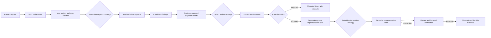
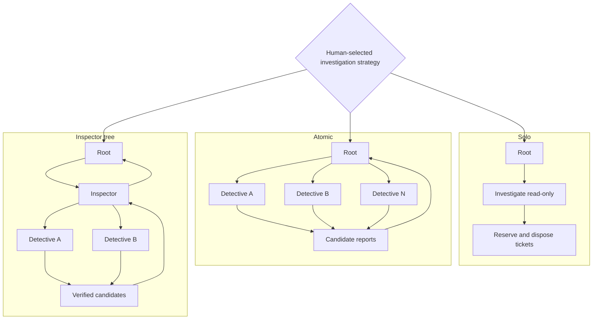
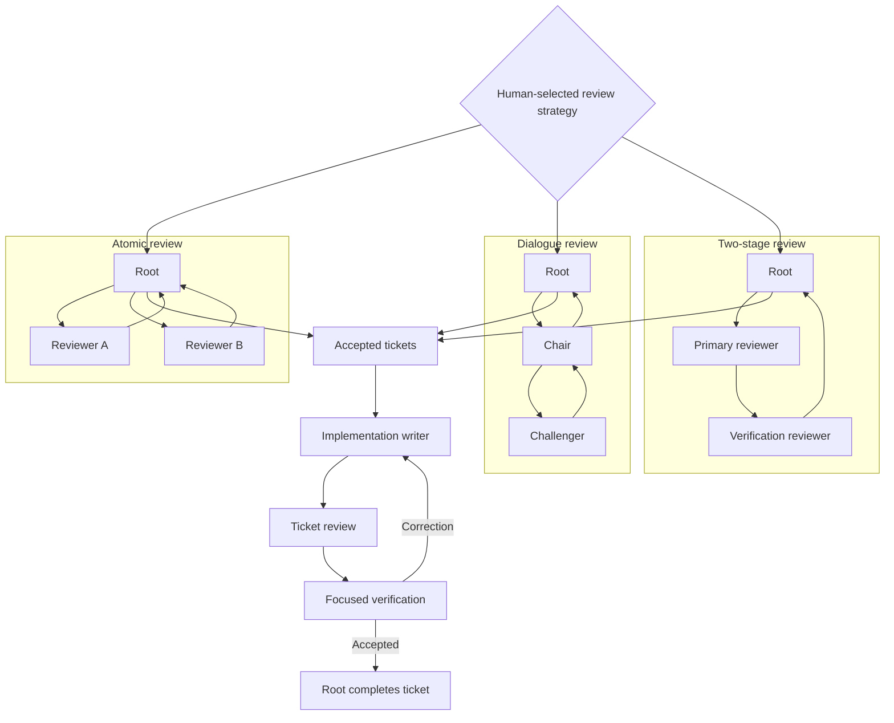

# Casefile workflow

Casefile is a governed workflow for investigating repository work, turning
evidence into reviewable tickets, and implementing only the tickets that pass
review. It keeps the human-selected strategy, root-agent authority, write
ownership, decisions, and verification visible throughout the task.

It is not a fixed chain of autonomous agents. The agent that receives the
request remains the root orchestrator. The human selects a compatible strategy
for each phase, and the selected vendor adapter supplies the concrete agent
profiles and runtime bindings.

## Skill surface

- `casefile` starts or resumes governed work.
- `casefile-investigate` selects solo, atomic, or inspector-tree investigation.
- `casefile-review` selects atomic, dialogue, or two-stage review.
- `casefile-implement` runs accepted ticket batches with exclusive ownership.
- `casefile-switch` changes strategy without losing work or root authority.
- `casefile-close` promotes resolved evidence and reports what remains.

## Lifecycle



## Investigation agent graphs

The human chooses one compatible investigation shape. Casefile never silently
falls back to another strategy.



- **Solo** keeps investigation and disposition at the root for narrow,
  inseparable work.
- **Atomic** assigns disjoint questions or source surfaces to independent
  detectives. Detectives cannot spawn children.
- **Inspector tree** gives each inspector a bounded domain. Inspectors may
  delegate disjoint questions to detectives and recommend dispositions, but
  the root retains cross-domain duplicate and final ticket authority.

All delegated investigation is source-read-only. Investigators report a
candidate before the root reserves a ticket ID and path.

## Review and implementation agent graphs



Reviewers write evidence only; they do not edit source or tickets. The root
reconciles reports, routes corrections, records human decisions, and escalates
unresolved contention. During implementation, one writer owns every set of
overlapping paths. Corrections return to that writer, and the root completes a
ticket only after its recorded review flow accepts it.

## How it works

1. **Open the casefile.** Resolve the configured planning store, map the
   project namespace to its absolute source directory in `projects.toml`, and
   validate the map before creating project records.
2. **Select a strategy.** Enumerate compatible matrices for the current phase,
   explain their requirements, and wait for the human to choose. Copy and
   validate the exact selected matrix in the casefile.
3. **Investigate without writes.** Give every worker a disjoint scope. Workers
   return evidence-backed candidates; the root arbitrates duplicates and alone
   reserves ticket IDs, paths, and dispositions.
4. **Review the tickets.** Apply the selected evidence-only review graph.
   Rejected tickets retain rationale. Non-obvious decisions return to the human
   and are recorded before disposition.
5. **Plan accepted work.** Order accepted tickets by dependency, assign one
   owner to overlapping mutations, and preserve the selected review flow in
   the implementation plan.
6. **Implement and verify.** Writers return immutable commits and focused
   evidence. Review and verification findings route back as bounded
   corrections; accepted tickets close only after the recorded gates pass.
7. **Close out.** Promote resolved evidence, decisions, tickets, matrices, and
   verification records to configured durable storage. Keep active or failed
   work in task scratch.

Strategies may change during any phase through the `casefile-switch` skill.
Before switching, Casefile inventories active work and ownership, requires a
new explicit selection, and refuses unavailable capabilities, changed root
authority, lost work, or overlapping active writers.

## Durable record

A governed casefile follows the layout in
[`schemas/investigation-layout.md`](schemas/investigation-layout.md):

```text
projects.toml
projects/<project>/investigations/<date>-<slug>/
  request.md
  strategy/
  tickets/{provisional,accepted,rejected}/
  decision-log/
  evidence/
  review/
  implementation-plan/
```

The portable core contains:

- [`roles/`](roles/) for agent responsibilities and authority boundaries;
- [`schemas/`](schemas/) for project maps, matrices, transitions, tickets,
  decisions, and verification records;
- [`scripts/`](scripts/) for deterministic project-map and strategy-transition
  checks.

Runtime-specific matrices and agent profiles live in vendor adapters, not in
this portable core.

## Start a Casefile

Invoke the installed `casefile` skill with a bounded investigation
request:

```text
Investigate this repository with Casefile. Preserve accepted findings as governed tickets, show me the compatible investigation strategies, and wait for my selection.
```
